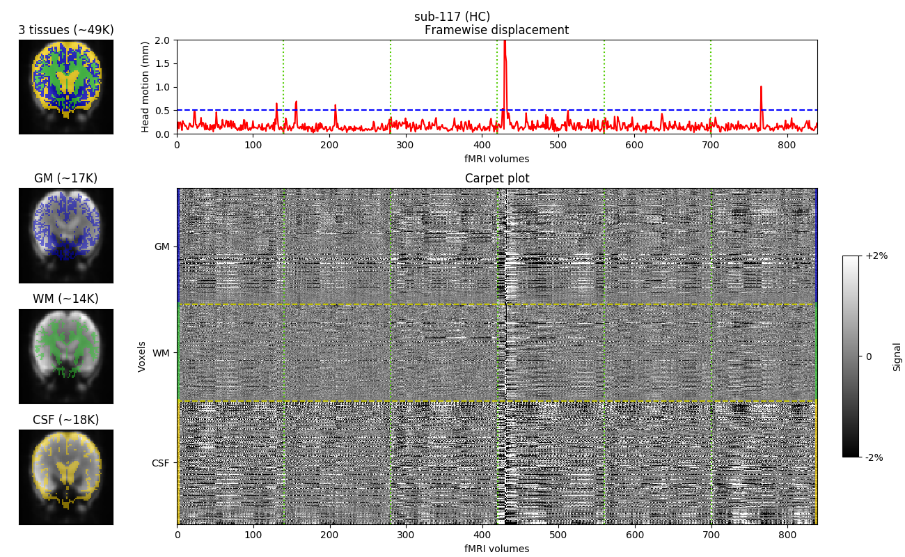

# pyThePlot
ThePlotFMRI allows to create a figure summarizing a functional data set as Jonathan Power introduced it in 2017. 

The fMRI data set is assumed to be preprocessed with SPM. The functional file and some pre-processed files are mandatory to run this script. I can recommend this post from Stephan Heunis to know more about pre-processing steps : https://www.fmrwhy.com/2018/07/20/the-plot-spm/. 

This script performs the plotting only, not the pre-processing.

## Run "ThePlot"
To run ThePlot for the first time, I provided an example data set: execute the command below from the repository

```python thePlotFMRI.py -f test_data/bold_subject_task1-vibration_run-1.nii.gz -r test_data/rp_subject_task1-vibration_run-1.txt -g test_data/rc1_subject_T1w.nii.gz -w test_data/rc2_subject_T1w.nii.gz -c test_data/rc3_subject_T1w.nii.gz -o test_example.png```



## To do
- [ ] Provide options to the user (plot Framewise Displacement, plot Mean Signal, plot DVARS)
- [ ] Compute and Plot DVARS
- [ ] Plot mean signal 
- [ ] Reformat the code (prepare data one one side) 

